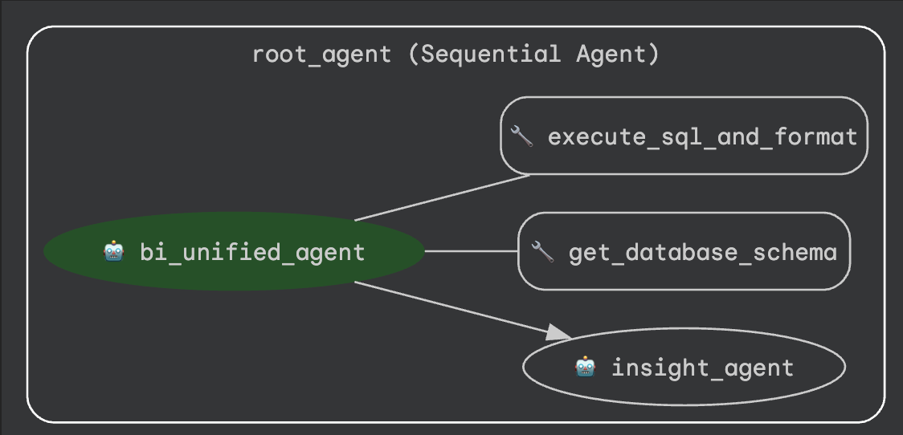

# Agentic AI for Business Intelligence  
### Short Technical Report

---

## 1. System Architecture

  

  <em>Figure 1. Unified Agentic Architecture</em>

The proposed system adopts a **Unified Agentic Architecture** designed to integrate reasoning, validation, and controlled tool invocation within a single coordinated execution loop.

The architecture consists of three primary components:

### 🔹 Root Agent (Orchestrator)
Responsible for managing execution flow and delegating tasks to specialized sub-agents.

### 🔹 BI Unified Agent
Performs:
- Business intent analysis  
- Schema grounding  
- SQL generation  

These steps are executed within a consolidated reasoning loop to minimize latency and token redundancy.

The agent interacts exclusively through controlled tools:
- `get_database_schema`
- `execute_sql_and_format`

### 🔹 Insight Agent
Receives structured query results and performs:
- Automatic visualization selection  
- Plain-language analytical explanation  

An **intelligent error-handling loop** captures SQL execution errors and iteratively refines queries until successful execution is achieved.

Compared to a traditional multi-step pipeline, this architecture improves:

- SQL reliability  
- Response latency  
- API cost efficiency  
- Overall system stability  

---

## 2. Prompting Strategy

The system applies structured, schema-aware prompting to enhance semantic accuracy and reduce hallucination.

### 2.1 SQL Generation Prompt

The SQL agent is guided by:

- Explicit role definition  
- Contextual schema injection  
- Strict enforcement of **SELECT-only** query generation  
- Structured reasoning steps:
  - Entity identification  
  - Join determination  
  - Filtering logic  
  - Aggregation logic  

This structured reasoning design significantly reduces incorrect joins, hallucinated tables, and semantic misalignment.

### 2.2 Visualization & Insight Prompt

The Insight Agent prompt instructs the model to:

- Analyze dataset structure and dimensionality  
- Select appropriate chart types  
  - Line chart → Time-series  
  - Bar chart → Categorical comparison  
- Generate concise, business-oriented explanations  

This design improves interpretability and supports non-technical decision-makers.

---

## 3. Safety Measures

To mitigate prompt injection risks and ensure secure enterprise deployment, multiple guardrails were implemented.

### 🔐 SQL Execution Restrictions
- Only **SELECT** statements are permitted.  
- Destructive operations (DROP, DELETE, UPDATE, INSERT, ALTER) are explicitly blocked.  
- SQL structure is validated prior to execution.

### 🔐 Tool-Based Access Control
The LLM does not directly access the database.  
All database interactions occur exclusively through predefined tools:

- `get_database_schema`
- `execute_sql_and_format`

This controlled interface prevents arbitrary command execution and enforces strict boundaries.

### 🔐 Schema-Grounded Context Injection
Only relevant schema metadata is dynamically retrieved, which:
- Reduces hallucination risk  
- Limits information exposure  
- Improves semantic precision  

### 🔐 Error Feedback Loop
If execution fails:
1. The database error message is captured  
2. The error is fed back to the agent  
3. A refined SQL query is regenerated  

This iterative correction mechanism enhances robustness and execution success rates.

---

## 4. Evaluation Procedure

System performance was evaluated using structured business queries categorized by complexity:

- Aggregation queries (SUM, COUNT, AVG)  
- Multi-condition filtering  
- Time-series trend analysis  
- Comparative analytical queries  

Each query was tested under both:
- Baseline multi-step LLM pipeline  
- Optimized unified agent architecture  

### 4.1 Evaluation Metrics

Performance was assessed across four dimensions:

**1. SQL Execution Accuracy**  
- Syntactic correctness  
- Semantic correctness  

**2. End-to-End Latency**  
Measured from user input submission to final visualization and explanation output.

**3. Visualization Appropriateness**  
Evaluates alignment between dataset structure and selected chart type.

**4. API Cost Efficiency**  
- Number of model invocations  
- Token consumption per query  

The optimized architecture demonstrated:

- Higher SQL accuracy  
- Reduced latency  
- Lower token usage  
- Stable performance within rate limits  

---

This framework demonstrates that a structured Agentic AI architecture can transform traditional Business Intelligence workflows into an intelligent, self-service analytics platform.
